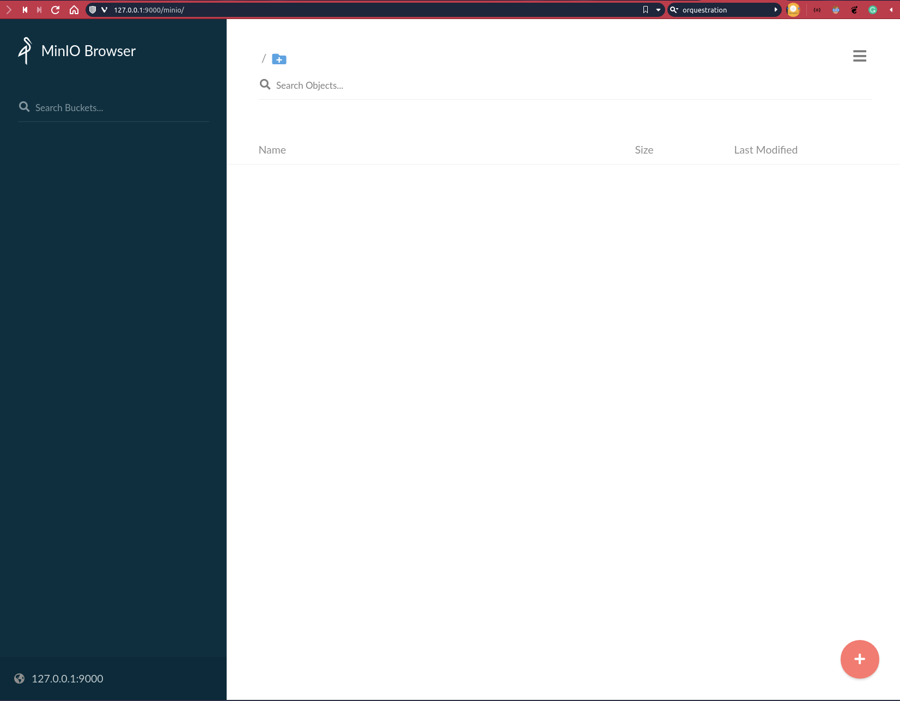

# Data Infra on K8s

## Pre-Requisites

You'll need to have the following tools installed to run this example.

- **docker**: https://docs.docker.com/engine/install/
- **kinD**: https://kind.sigs.k8s.io/docs/user/quick-start/
- **helm**: https://helm.sh
- **kubectl**: https://kubernetes.io/docs/tasks/tools/
- **kubens** and **kubectx** CLI: https://github.com/ahmetb/kubectx


## Creating the environment

### Create the cluster

As we'll be setting up a lot of big data tools, I'll not restrict the resources of the cluster.

Go to the folder `00_cluster` and run:

```bash
$ kind create cluster --name big-data-infra --config $ kind-cluster.yaml
```

If you look at the cluster resources, you'll see that your whole machine will be available for the cluster.

```bash
$ kubectl describe nodes
```

### Mysql 

Now, we'll be setting up a MySQL database and put some data to work with.

At this point, we'll be using mostly helm charts to install all the tools that we need. But before that we'll create a namespace specific to the mysql.

```bash
$ kubectl create namespace mysql-app-storage
$ kubens mysql-app-storage
```

Installing mysql...

```bash
$ helm repo add bitnami https://charts.bitnami.com/bitnami
$ helm install mysql bitnami/mysql --namespace mysql-app-storage
```

Get administrator credentials:

```bash
echo Username: root
echo Password : $(kubectl get secret --namespace mysql-app-storage mysql -o jsonpath="{.data.mysql-root-password}" | base64 --decode)
```

Exposing the port.

```bash
$ kubectl port-forward mysql-0 3306:3306
```

Now you can use any local tool to login and interact with the mysql database. Let's configure another component of our infrastructure.


### Data Lake

Our simulated data lake will be provided by MinIO. Let's create this namespace by running:

```bash
$ kubectl create namespace minio-deep-storage
```

```bash
$ helm repo add bitnami https://charts.bitnami.com/bitnami
$ helm install minio bitnami/minio --namespace minio-deep-storage
```

Get login credentials

```bash
$ export ACCESS_KEY=$(kubectl get secret --namespace minio-deep-storage minio -o jsonpath="{.data.access-key}" | base64 --decode)
$ export SECRET_KEY=$(kubectl get secret --namespace minio-deep-storage minio -o jsonpath="{.data.secret-key}" | base64 --decode)
$ echo $ACCESS_KEY
$ echo $SECRET_KEY
```

Building a Data Lake with MinIO.

```bash
$ helm install minio bitnami/minio --namespace minio-deep-storage
```

After all pods are running, port-forward your storage:

```bash
kubectl port-forward --namespace minio-deep-storage svc/minio 9000:9000
```

Now you can configure your data lake locally at port 9000 to use later with the Airflow orchestration.



### Spark

Configuring a Spark On K8s Operator to run.


### Pinot

Building an OLAP datastore.


### Superset

Building a data viz tool.


## Airflow

Creating an orquestration with Airflow to move the data between those steps.