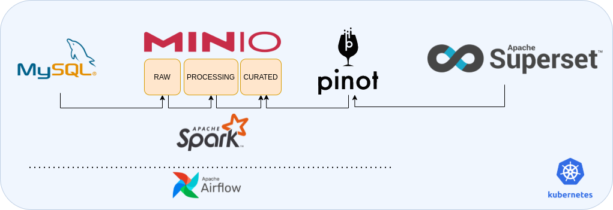

# Data Infra on K8s

## Pre-Requisites

You'll need to have the following tools installed to run this example.

- **docker**: https://docs.docker.com/engine/install/
- **kinD**: https://kind.sigs.k8s.io/docs/user/quick-start/
- **helm**: https://helm.sh
- **kubectl**: https://kubernetes.io/docs/tasks/tools/
- **kubens** and **kubectx** CLI: https://github.com/ahmetb/kubectx


## Goal

The objective of this project is to build the following infra-structure using k8s to allow you to **process and visualize big data**. And also keep everything **orchestrated by Airflow**.




## Creating the environment

### Create the cluster

As we'll be setting up a lot of big data tools, I'll not restrict the resources of the cluster.

Go to the folder `00_cluster` and run:

```bash
$ kind create cluster --name big-data-infra --config $ kind-cluster.yaml
```

If you look at the cluster resources, you'll see that your whole machine will be available for the cluster.

```bash
$ kubectl describe nodes
```

### Mysql 

Now, we'll be setting up a MySQL database and put some data to work with.

At this point, we'll be using mostly helm charts to install all the tools that we need. But before that we'll create a namespace specific to the mysql.

```bash
$ kubectl create namespace mysql-app-storage
$ kubens mysql-app-storage
```

Installing mysql...

```bash
$ helm repo add bitnami https://charts.bitnami.com/bitnami
$ helm install mysql bitnami/mysql --namespace mysql-app-storage
```

Get administrator credentials:

```bash
echo Username: root
echo Password : $(kubectl get secret --namespace mysql-app-storage mysql -o jsonpath="{.data.mysql-root-password}" | base64 --decode)
```

Exposing the port.

```bash
$ kubectl port-forward mysql-0 3306:3306
```

Now you can use any local tool to login and interact with the mysql database. Let's configure another component of our infrastructure.


### Data Lake

Our simulated data lake will be provided by MinIO. Let's create this namespace by running:

```bash
$ kubectl create namespace minio-deep-storage
```

```bash
$ helm repo add bitnami https://charts.bitnami.com/bitnami
$ helm install minio bitnami/minio --namespace minio-deep-storage
```

Get login credentials

```bash
$ export ACCESS_KEY=$(kubectl get secret --namespace minio-deep-storage minio -o jsonpath="{.data.access-key}" | base64 --decode)
$ export SECRET_KEY=$(kubectl get secret --namespace minio-deep-storage minio -o jsonpath="{.data.secret-key}" | base64 --decode)
$ echo $ACCESS_KEY
$ echo $SECRET_KEY
```

Building a Data Lake with MinIO.

```bash
$ helm install minio bitnami/minio --namespace minio-deep-storage
```

After all pods are running, port-forward your storage:

```bash
kubectl port-forward --namespace minio-deep-storage svc/minio 9000:9000
```

Now you can configure your data lake locally at port 9000 to use later with the Airflow orchestration.


### Spark

We'll be using Spark On K8s operator here. This is a very simple way to submit a spark job to be executed on k8s.

The first thing you need is a spark job wroted in your preference language, I'll be use the python implementation called PySpark. You can find the job on this directory:

```sh
$ cd 03_spark/pr-elt-business/
```

And the file have the following name `pr-elt-business.py`.

Change this line to the IP inside of your minio namespace:

```python
.set("spark.hadoop.fs.s3a.endpoint", "http://10.244.3.5:9000")
```

You can find the IP address looking with the following command:

```sh
$ kubectl kubens minio-deep-storage
$ kubectl get pods
$ kubectl describe pod/<MinioPodName>
```

Now we need to send an image to the docker-hub with our containerized spark job. For that, you need to build the and push to some repository.

```sh
$ docker login
$ cd 03_spark/
$ docker build . -t big-data-infra-use-case:1.0.0
$ docker tag big-data-infra-use-case:1.0.0 yourRepo/big-data-infra-use-case:1.0.0

# push image to registry
docker push owshq/owshq-pr-elt-business:3.0.0
```

Now that we have all set, we can finally install the spark operator.

```sh
helm repo update
helm install spark spark-operator/spark-operator --namespace spark-operator
helm ls -n spark-operator
```

After your deployment has fineshed, you'll need to grant access for the Spark on the cluster running the following lines:

```sh
kubectl create serviceaccount spark
kubectl create clusterrolebinding spark-role --clusterrole=edit --serviceaccount=default:spark --namespace=default
```

Now you're all set to send spark jobs to process on the cluster. The way how this goes is by running a yaml file with the job specs, the Spark will look what need to be processed and scale the executors.

```sh
kubectl apply -f 03_spark/dags/pr-elt-business.yaml -n spark-operator
```

After this process you'll have some parquet files on the minio storage.


### Pinot

Building an OLAP datastore. (online setup, port-forward controller:900 and broker:8099)

pinot://127.0.0.1:8099/query/sql?controller=http://127.0.0.1:9000/


### Superset

Building a data viz tool. (online setup, port-forward UI 8088), personalized values.yaml on 05_superset.


## Airflow

Creating an orquestration with Airflow to move the data between those steps.